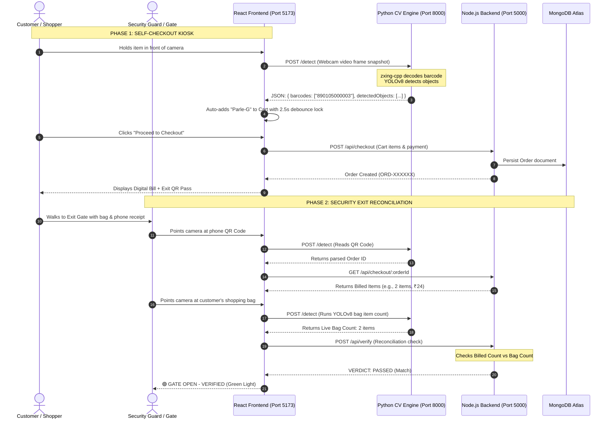

# 🛒 Smart Retail AI Self-Checkout & Queue Management System

[](https://fastapi.tiangolo.com)
[](https://github.com/ultralytics/ultralytics)
[](https://reactjs.org)
[](https://nodejs.org)
[](https://www.mongodb.com)
[](https://tailwindcss.com)

An end-to-end, full-stack **Smart Retail Self-Checkout and Computer Vision Anti-Theft Verification Ecosystem**. This system replaces traditional, slow cashier checkout lines with real-time AI perception, automated bag inspection, customer loyalty authentication, and predictive store queue analytics.

---

## 🏛️ System Architecture

The ecosystem operates as a modern **3-Tier Microservices Architecture**:



---

## 🧩 Deep Dive into Services

### 1. 🐍 Python Computer Vision Microservice (`cv_service/`)
* **Technology**: Python 3.13, FastAPI, Uvicorn, YOLOv8 (Nano), `zxing-cpp`, OpenCV-headless, NumPy
* **Port**: `http://localhost:8000`
* **Responsibilities**:
  * **Dual Perception Engine**: On every video frame received from the browser, it simultaneously performs:
    1. **Industrial Barcode & QR Decoding** using `zxing-cpp` (handles phone screen reflections and glare with 0 latency).
    2. **Deep Learning Object Detection** using `yolov8n.pt` (identifies bottles, cups, books, bags, persons, and counts total physical units).
  * **CORS Enabled**: Accepts multipart image uploads directly from the React frontend.
  * **Endpoints**:
    * `GET /` — Health check endpoint.
    * `POST /detect` — Accepts image blob (`multipart/form-data`) and returns structured JSON with bounding boxes, confidence ratings, decoded barcodes, and total item counts.

---

### 2. 🟢 Node.js Business Backend (`server/`)
* **Technology**: Node.js, Express.js, MongoDB Atlas (Mongoose ODM), JWT (`jsonwebtoken`), `bcryptjs`, CORS
* **Port**: `http://localhost:5000`
* **Responsibilities**:
  * **Product Catalog Management**: CRUD operations for retail SKUs with barcodes, prices, stock quantities, and CV detection labels.
  * **Customer Authentication (JWT)**: Customer registration & login with password hashing, issuing 7-day signed JWT tokens and tracking loyalty rewards points.
  * **Admin Authentication (JWT)**: Store Manager sign-in portal protecting sensitive analytics and inventory modification endpoints.
  * **Anti-Theft Verification Engine**: Compares billed order quantities against YOLO camera detected items to flag discrepancies (`PASSED`, `QUANTITY_MISMATCH`, `UNBILLED_EXTRA_ITEM`).
  * **Queue & Footfall Analytics Engine**:
    * Dynamic wait time formula: $$\text{Wait Time (mins)} = \frac{\text{Active Shoppers} \times \text{Avg Items} \times \text{Scan Speed}}{\text{Active Kiosks} \times 60}$$
    * Day-of-week footfall distribution (identifying weekend peak traffic at 42%).
    * Hourly rush hour heatmaps (Morning, Afternoon, Evening Peak, Night).
    * AI store optimization and staffing recommendations.

---

### 3. ⚛️ React Frontend Application (`client/`)
* **Technology**: React 18, Vite, Tailwind CSS v4, Axios, React Router DOM v6, `qrcode.react`, HTML5 MediaDevices & Canvas APIs
* **Port**: `http://localhost:5173`
* **Portals**:

#### A. 🛒 Customer Self-Checkout Kiosk (`/kiosk`)
* Live WebCam scanner with automatic barcode detection & 2.5-second duplicate debounce protection.
* Customer JWT login modal with loyalty points balance badge.
* Interactive shopping cart with add, remove, increment, and decrement controls.
* "Proceed to Checkout" payment simulation with digital receipt modal and high-density **Exit QR Pass**.

#### B. 🛡️ Security Exit Gate Portal (`/security`)
* Automated camera scanner that decodes the customer's phone Receipt QR Code.
* Live overhead bag inspection powered by YOLOv8.
* Discrepancy reconciliation engine with full visual feedback (**🟢 GATE OPEN** vs **🚨 GATE LOCKED ALERT**).
* Interactive simulation buttons for testing edge cases (*Perfect Match*, *Missing Item*, *Unbilled Theft*).

#### C. 📊 Admin & Queue Analytics Portal (`/admin`)
* Protected by **Manager Sign-In Guard** (`admin@retail.com` / `admin123`).
* Visual Bar Chart of weekly customer footfall distribution.
* Hourly rush hour heatmap and store congestion level meter.
* Real-time estimated queue wait times.
* Product inventory management table with **"+ Add New SKU"** modal.

---

## 🗄️ Database Schemas (MongoDB)

| Collection | Key Fields | Description |
| :--- | :--- | :--- |
| **`products`** | `productName`, `barcode`, `category`, `price`, `stock`, `cvLabel`, `isActive` | Retail items available for purchase |
| **`customers`** | `name`, `phone`, `email`, `password`, `loyaltyPoints`, `createdAt` | Customer accounts with hashed passwords |
| **`orders`** | `orderId`, `customerId`, `items: [{ productName, barcode, price, quantity, subtotal }]`, `totalAmount`, `paymentMethod`, `status` | Completed transactions |
| **`verificationLogs`** | `orderId`, `billedCount`, `scannedCount`, `status`, `scannedItems`, `timestamp` | Security gate audit logs |

---

## 🚀 Installation & Setup Guide

### Prerequisites
* **Node.js** (v18 or higher)
* **Python** (v3.10 to v3.13)
* **Git**
* **MongoDB Atlas** connection string (or local MongoDB)

---

### Step 1: Clone the Repository
```bash
git clone https://github.com/your-username/smart-retail-checkout.git
cd smart-retail-checkout
```

---

### Step 2: Set Up Backend (`server/`)
```bash
cd server
npm install
```

Create a `.env` file inside `server/`:
```env
PORT=5000
MONGO_URI=your_mongodb_connection_string_here
JWT_SECRET=super_secret_retail_key_123
ADMIN_EMAIL=admin@retail.com
ADMIN_PASSWORD=admin123
```

Seed the product catalog:
```bash
node data/seeder.js
```

Start the backend server:
```bash
node server.js
```
*(Runs on `http://localhost:5000`)*

---

### Step 3: Set Up Python CV Service (`cv_service/`)
Open a **second terminal**:
```bash
cd cv_service

# Create virtual environment
python -m venv venv

# Activate virtual environment
# On Windows (PowerShell):
.\venv\Scripts\Activate.ps1
# On Linux/macOS:
source venv/bin/activate

# Install dependencies
pip install fastapi uvicorn[standard] opencv-python-headless ultralytics zxing-cpp python-multipart numpy

# Start CV service
uvicorn main:app --reload --port 8000
```
*(Runs on `http://localhost:8000` — interactive docs at `http://localhost:8000/docs`)*

---

### Step 4: Set Up React Frontend (`client/`)
Open a **third terminal**:
```bash
cd client
npm install
npm run dev
```
*(Runs on `http://localhost:5173`)*

---

## 📡 Complete REST API Reference

### 🛍️ Products API
| Method | Endpoint | Description | Auth Required |
| :--- | :--- | :--- | :--- |
| `GET` | `/api/products` | Get all active products | No |
| `POST` | `/api/products` | Create a new product SKU | No |

### 👤 Customer Authentication API
| Method | Endpoint | Description | Auth Required |
| :--- | :--- | :--- | :--- |
| `POST` | `/api/customers/register` | Register customer & get JWT token | No |
| `POST` | `/api/customers/login` | Login customer & get JWT token | No |
| `GET` | `/api/customers/profile` | Get current customer profile | Yes (`Bearer <token>`) |

### 🔐 Admin Authentication API
| Method | Endpoint | Description | Auth Required |
| :--- | :--- | :--- | :--- |
| `POST` | `/api/admin/login` | Store manager sign-in | No |

### 🧾 Checkout & Verification API
| Method | Endpoint | Description | Auth Required |
| :--- | :--- | :--- | :--- |
| `POST` | `/api/checkout` | Process payment & create Order | No |
| `GET` | `/api/checkout/:id` | Get order details by ID | No |
| `POST` | `/api/verify` | Reconcile billed items vs bag AI count | No |

### 📊 Analytics API
| Method | Endpoint | Description | Auth Required |
| :--- | :--- | :--- | :--- |
| `GET` | `/api/analytics/store-insights` | Get footfall, rush hours & queue data | No |

---

## 🔒 Security & Anti-Theft Logic

1. **Barcode Anti-Spam (Debounce Lock)**: When an item is scanned at the Kiosk, the scanner locks for **2.5 seconds** with visual audio feedback, preventing 50 duplicate items from being added in a single second.
2. **Industrial Scanner (`zxing-cpp`)**: Decodes barcodes directly from phone screens even under harsh supermarket glare and lighting.
3. **Reconciliation Decision Engine**:
   - `Billed Count == Detected Bag Count` $\rightarrow$ **Gate Opens (Pass)**
   - `Detected Bag Count > Billed Count` $\rightarrow$ **Theft / Unbilled Item Alert (Gate Locked)**
   - `Detected Bag Count < Billed Count` $\rightarrow$ **Missing Item Warning (Gate Locked)**
4. **Password Security**: Passwords hashed with salted `bcryptjs` (Cost factor 10) before MongoDB persistence.

---

## 📤 How to Push to GitHub

1. Create a `.gitignore` in your project root:
```gitignore
node_modules/
client/node_modules/
server/node_modules/
cv_service/venv/
cv_service/yolov8n.pt
.env
dist/
.DS_Store
```

2. Initialize git and commit:
```bash
git init
git add .
git commit -m "feat: complete full-stack smart retail self-checkout and queue management ecosystem"
```

3. Link your remote repository and push:
```bash
git branch -M main
git remote add origin https://github.com/your-username/smart-retail-checkout.git
git push -u origin main
```

---

## 👨‍💻 Developed As
A comprehensive learning & production-grade project demonstrating **AI/Computer Vision integration with modern Full-Stack Web Development**.
